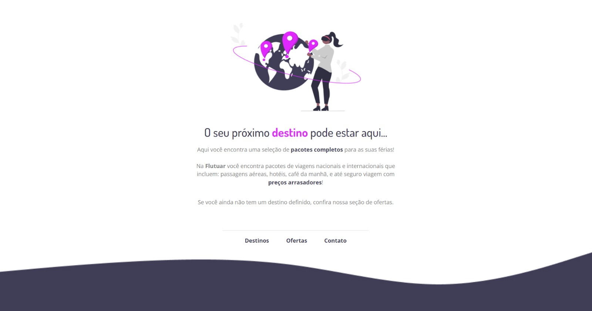

<h1 align="center"> Desafio 01 </h1>

 

  

## Sobre o desafio

Este foi o primeiro desafio do curso da rocketseat.   
Foi disponibilizado o projeto no Figma e o desafio era codificar com o que foi aprendido na aula sobre HTML e CSS.  
A construção do HTML foi tranquila, e a maior dificuldade foi na organização de todos os elementos no CSS.  

## Tecnologias utilizadas

Esse projeto foi desenvolvido com as seguintes tecnologias:

- HTML e CSS
- Git e Github
- Figma

